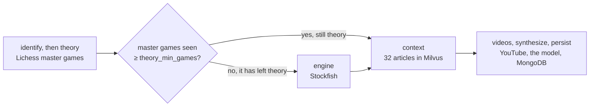
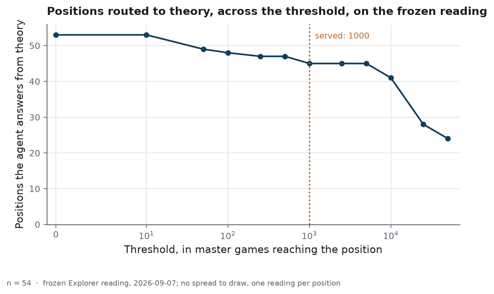
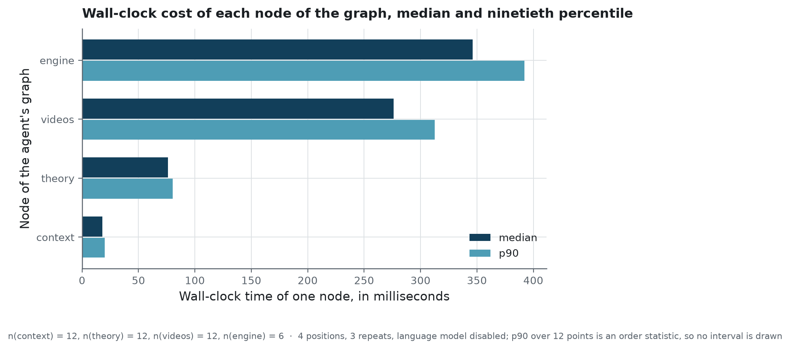

<h1 align="center">Chess opening coach</h1>

<p align="center">A chess agent that routes a position to a database, an engine or a corpus before a model writes</p>

<p align="center">
  
  
  
  
</p>

<!-- source: docs/images/MANIFEST.json -->


**Project status** — finished, and archived in a runnable state. It coaches club players on
their chess openings. Each figure printed here was taken from an artefact this repository
tracks, and each of those artefacts is the output of one script; the workflows recompute
none of them. The whole stack comes up with one
`docker compose up`: six services, of which the vector store is the slowest to be ready. The
reference articles are downloaded by the reader, because they belong to their authors.

## The problem

A club coach looks at a position and says one of three different things. *This is the Ruy
Lopez, and here is the idea behind it.* Or: *this is a sideline, nobody plays it, let us see
what the engine thinks.* Or: *here is a video that explains it better than I will.*

A language model asked the same question answers all three at once, fluently, and invents the
move counts. That is the failure this repository is arranged against. The trouble is not that
the model writes badly. It is that **nothing tells it which of the three cases it is looking
at**, and nothing gives it the figures it will quote regardless.

So the model is not the system here. It is the last node of a graph that has already decided.
Theory comes from a database of master games, the evaluation from an engine, the explanation
from a corpus of articles, the videos from a search API. The model is handed those facts and
asked to write four sentences.

Which leaves the two decisions the system actually takes, and this repository is built around
measuring them: **when is a position still theory, and how do you ask a knowledge base a
question it can answer.**

## What it does

Six containers under Docker Compose, one command. A LangGraph agent routes a position
through four sources and writes the answer.



- **Theory**: the [Lichess Opening Explorer](https://lichess.org/api#tag/Opening-Explorer)
  over the master-games database, with a local opening book behind it so the agent still
  answers without a token.
- **Engine**: [Stockfish](https://stockfishchess.org/), called only once the position has
  left theory.
- **Context**: retrieval over 32 articles indexed in [Milvus](https://milvus.io/):
  21 [Wikichess](https://ficgs.com/wikichess.html) pages in English and 11 notes written in
  French for a young player. The downloaded pages stay out of this repository for a licence
  reason `docs/data-source.md` sets out; one command fetches them again.
- **Videos**: the YouTube Data API.
- **Synthesis**: an OpenAI-compatible model turns those facts, and only those, into four
  sentences. Without a key, or when the call fails, a deterministic French template takes
  over and the agent still answers.

Every analysis is written to MongoDB, so the last positions looked at come back in the
interface.

When the position is not theory, the same screen changes source and says so:

<!-- source: docs/images/MANIFEST.json -->


### How it is built

The backend is **FastAPI** behind **Uvicorn**, and every response shape is a **Pydantic**
model, which is what makes the generated OpenAPI page the API documentation and not a second
description of it. The orchestration is **LangGraph**: a fixed sequence of nodes with
one conditional edge, so the routing is a comparison between two integers and can be swept.
The only **LangChain** dependency is the client that talks to an OpenAI-compatible endpoint,
at the last node.

Retrieval is **sentence-transformers** over a multilingual model, which **PyTorch** runs on
the CPU; the image points at the CPU-only wheels, which is the difference between a two-
gigabyte image and a ten-gigabyte one. The vectors live in Milvus, the history in MongoDB, and the
engine is a binary installed in the image and driven as a subprocess.

The interface is **Angular** with Material and `ngx-chess-board`, served by nginx, which
proxies `/api/` to the backend. Dependencies are locked by **uv**; **pytest** runs three tiers
of tests with warnings as errors, **Ruff** lints and formats, and **Bandit** scans the source
on every push.

## The result

### How the question is worded decides what comes back

Retrieval is scored on 14 hand-written questions, each labelled with the set of articles that
should come back. Four wordings, same corpus, same index:

<!-- source: backend/reports/ablation_retrieval.json -->

| Variant | recall@1 | recall@3 | mrr |
|---|---|---|---|
| `name-only` (the opening name alone) | 0.93 | 1.00 | 0.964 |
| **`french-question`**, what the agent sends | **0.86** | **1.00** | **0.929** |
| `english-verbose` (a padded English wording) | 0.50 | 0.86 | 0.693 |
| `name-and-eco` (the name plus its ECO code) | 0.93 | 0.93 | 0.946 |
n = 14 cases, each with a hard label and no judge.

**Padding the question is what hurts.** The verbose English wording drops recall@1 from 0.86
to 0.50, which is five questions of the fourteen. Its generic words are the vocabulary every
article of the corpus shares, so it pulls the most general pages to the top: asked about the
Ruy Lopez it returns the King's Pawn article at rank 1 and the right article at rank 6.

**The French wording costs one case against the bare opening name,** which on fourteen cases
is 0.07 of recall and therefore inside the floor this study declares. What the numbers
separate is a wide gap and not a narrow one. The phrasing is not what matters; not drowning
the name is.

**These four rows are worse than the ones this repository published a week ago, and that is
the interesting part.** The screenshot at the top of this page exposed a product defect: what an article writes
above its first sentence, four lines of codes and links, was reaching the player as though it
were prose. It was reaching the embedder too.
Taking it out of the indexed text cost the served wording one case, and cost `name-and-eco`
its perfect score, which had been 1.00 at every k.

That perfect score was the leak. The variant that appends an ECO code to the query was being
matched against a chunk that contained that same ECO code, so it was scoring a string
comparison and not a retrieval. `docs/protocol.md` says a question must never be drawn from
the article it points at, for exactly this reason; the codes in the text were the same failure
entering from the other side. The lower numbers are the ones that measure retrieval.

### The routing threshold sits on a plateau

`theory_min_games` is the agent's only conditional edge, and the value it holds decides
which half of the product a player meets. Two positions were looked at by hand when it was
first set. Here is what it does across a frozen reading of 54 positions:

<!-- source: backend/reports/theory_threshold_sweep.csv -->

| threshold | in_theory | flipped |
|---|---|---|
| 100 | 48 | 1 |
| 500 | 47 | 0 |
| **1000** *(served)* | **45** | **2** |
| 2500 | 45 | 0 |
| 5000 | 45 | 0 |
| 10000 | 41 | 4 |
| 25000 | 28 | 13 |
n = 54 positions, read from the `masters` database on 2026-09-07.

<!-- source: backend/reports/figures/MANIFEST.json -->


**Two positions of the 54 move when the value is divided by three, and none move when it is
tripled.** The stretch from 500 to 5 000 is flat, and the served value sits inside it. So a
number picked from two examples turns out to be safe, which is worth knowing and is more than
the way it was picked had earned.

The reading is committed with the day it was taken, because the Explorer is alive: its counts
climb, and a sweep asking it again would answer something else.

### What a question costs

Measured inside the deployed configuration, four positions, three repeats:

<!-- source: backend/reports/latency.json -->

| Node | median_ms | p90_ms |
|---|---|---|
| `context` (embedding and Milvus search) | 18.0 | 20.0 |
| `theory` (the Lichess Explorer call) | 76.2 | 80.4 |
| `videos` (the YouTube Data API call) | 276.1 | 312.4 |
| `engine` (the Stockfish call) | 346.1 | 392.1 |
n = 12 timings per node, 6 for the engine, which runs only on positions that left theory.
The engine is called at the depth `STOCKFISH_DEPTH` sets, fifteen plies in this configuration.

<!-- source: backend/reports/figures/MANIFEST.json -->


The retrieval, the part one worries about on a stack with a vector database, is the cheapest
node by a factor of four. What a request costs is the engine and YouTube, and the engine runs
only once the position has left theory. The bench leaves the language model out: its call is billed, and one slow generation on a
third-party endpoint would bury every local node. In a real request it is the dominant cost.

### The model writes up; it does not choose

One line of the prompt forbids inventing a move. Twenty-one positions were put to
`gpt-4o-mini` twice each, 42 billed calls, covering both branches of the graph.

<!-- source: backend/reports/move_invention.json -->

| Where a cited move came from | citations |
|---|---|
| Given in the prompt, by a tool | 68 |
| The opening's own line, quoted behind its move number | 45 |
| Legal in the position, not given by any tool | 1 |
| No such move in the position | 2 |
n = 116 cited moves, over 21 positions answered twice.

**Not one move was made up.** Three citations fell outside what the prompt had given, and all
three were read:

- *Caro-Kann*, a plan named in passing, `e5`, legal in the position. This is the only case
  where the model put forward a move no tool had handed it.
- *Italian*, `a6`, a reply in a line not yet played: illegal *now* because it is Black's move
  in a future position.
- *Scholar's Attack*, `Qh5`, the move that created the position on the board. Correct, and
  illegal now for the same reason.

The model's own wording of the three is quoted in
[`backend/reports/move_invention.md`](backend/reports/move_invention.md), in French, which is
the language it was asked to coach in.

So the two flags for a move that does not exist are an artefact of judging every citation
against the current board, when a coach talks about moves already played and moves that might
be. What the run establishes is the claim the interface depends on: **the moves come from the
tools.** Of 116 citations, 113 were either given in the prompt or part of the opening's own
line.

## Why these numbers can be believed

**The retrieval claim already existed, and had no artefact.** The docstring of
`build_context_query` asserted that a short French question beats a padded English one, and
the commit that introduced it said "verified on six openings". The observation was right, the
ablation above confirms it and puts 36 points on it, and nothing in the repository recorded
which six openings, what came back, or what was compared to what. Nobody could replay it, and
nothing would have said when it stopped being true.

**The evaluation questions are written by hand, never generated from their target.** A
question drawn from the article it is supposed to retrieve measures string matching. The label
is the file name, so the score needs no judge and costs nothing.

**An opening can have more than one right article.** Three files cover the Ruy Lopez between
them, so each case is labelled with all of them. Picking one of the three as the answer would
mark a retrieval wrong for returning a different correct file.

**Fragments of one article count once.** An article enters the index in pieces, and a single
opening could otherwise hold every slot of a top three. Left uncollapsed, the score rises at
every k for a reason that belongs to the chunker.

**Warnings are errors.** The test configuration used to silence three whole categories of
warning on a stack made of six libraries that move fast. Switching to
`filterwarnings = ["error"]` surfaced one on the first run, and the deprecation was followed
instead of being silenced again.

**The parser accused the model before it was right itself.** Ten citations came back as
non-existent moves and not one of the ten was: they were second moves of narrated lines,
squares named as places, and first moves quoted from an opening's history.
[`docs/protocol.md`](docs/protocol.md) says what each shape was and how it is now tested. The
table above comes from a later run, so the parser is not being marked on its own homework,
and the counts a stricter parser would produce are published next to it.

**No test touches the network.** Every external service is faked, and the three tiers are separated
by what they are allowed to touch: `backend/tests/unit/` forbids a socket outright,
`backend/tests/integration/` wires two real components together, and
`backend/tests/system/` starts the API as a process with none of its six services behind it,
which is the tier that found the twenty-second search and the model loaded inside the first
request.

Three tests guard the evaluation itself: that no case points at an article the corpus cannot
hold, that the `french-question` variant calls the agent's own function rather than a copy of
it, and that raising the threshold never puts *more* positions into theory.

## Running it

Docker Desktop must be running. [`docs/operations.md`](docs/operations.md) carries the rest of
it: the order things come up in, which routes work before the others, and where to look when
the interface goes quiet.

```powershell
copy .env.example .env       # optional keys: Lichess, YouTube, a language model
docker compose up -d --build

# download the Wikichess articles, which are not redistributed here
docker compose run --rm backend python -m scripts.fetch_wikichess

# load the knowledge base into Milvus, once — the volume keeps it
docker compose run --rm backend python -m scripts.ingest_wikichess
```

- Interface: <http://localhost:4200>
- API documentation: <http://localhost:8000/docs>

None of the three keys is required. Without them the book answers in place of the Explorer,
the template writes in place of the model, and no video is proposed.

The measurements are reproduced from [`docs/protocol.md`](docs/protocol.md), which says for
each one what it can and cannot separate. Checks: `uv run pytest` from `backend/`,
`uv run ruff check .`, `uv run bandit -c pyproject.toml -r src`, and
`npm test -- --watch=false --browsers=ChromeHeadless` in `frontend/`.

Eight routes, documented by the generated OpenAPI schema:

<!-- source: docs/images/MANIFEST.json -->


## Structure

```
├── backend/                  README: the API and its measurement scripts
│   ├── data/
│   │   ├── openings/         11 notes written in French, the local opening book's prose
│   │   └── eval/             the frozen inputs of the measurements
│   ├── notebooks/            the walkthrough, from a FEN to the agent's prompt
│   ├── reports/              what the measurement scripts publish, and the run evidence
│   ├── scripts/              ingestion, the four measurement scripts, the smoke run
│   ├── src/chess_coach/
│   │   ├── agent/            LangGraph state, nodes, graph, synthesis
│   │   ├── api/              routes, schemas, and the mapping between them
│   │   ├── evaluation/       the metrics, the query variants, the threshold sweep
│   │   ├── rag/              chunking and indexing
│   │   ├── services/         Lichess, Stockfish, YouTube, Milvus, MongoDB, the opening book
│   │   ├── utils/paths.py    every path of the project, resolved once
│   │   └── config.py         every tunable, read from the environment
│   ├── tests/                unit, integration and system
│   └── var/                  what a run leaves behind, including the downloaded corpus
├── frontend/                 README: the Angular interface
├── docs/                     architecture, data, protocol, operations, and one study
└── docker-compose.yml        the six services
```

[`docs/architecture.md`](docs/architecture.md) has the six containers, the graph and what
falls over when a key is missing, including the four designs that were considered and left
out. The two secondary READMEs are [`backend/README.md`](backend/README.md) and
[`frontend/README.md`](frontend/README.md). The study that is not built is
[`docs/feasibility_video_analysis.md`](docs/feasibility_video_analysis.md), also rendered as
[a paginated PDF](docs/feasibility_video_analysis.pdf), and [`metrics.yaml`](metrics.yaml)
defines every label used in a table above.

## What this does not prove

**Fourteen questions is a small set.** One question is worth 0.07 of recall, so the ablation
separates a wide gap from a narrow one and nothing finer. It establishes that padding the
query costs five questions; it does not rank the three variants that scored within one case of
each other.

**Thirty-two articles is a small corpus.** On a base this size the right answer is often
within reach, and a high recall@3 says more about the corpus than about the retrieval. What
remains measurable is the sensitivity to how the question is worded.

**One model, forty-two answers.** The invention check ran on `gpt-4o-mini` at temperature 0.3,
twice over twenty-one positions. Another model, or a longer answer, could behave differently.
It stays a script and not a test because every run of it is billed.

**The other half of the instruction is unchecked.** The model is also told to stay silent
about the engine unless an evaluation was supplied. No count exists for that, and producing
one would take a reader built for a different question.

**The history the model tells is not verified.** Forty-five of the citations are an opening's
own line, quoted behind its move number. That the line is the *right* one is not checked: the
frozen reading holds positions, not the move orders that reach them.

**The corpus is taken as it comes.** The Wikichess articles are indexed with their source and
their contributors, and this repository measures which one is returned, not whether what it
says is right.

**Nothing measures the quality of the written answer.** It would take a judge, and a judge
mostly measures the judge.

**Nothing here has been deployed.** Six containers on one machine, with localhost ports.
`docs/operations.md` says what a deployment would need and what this stack already carries.

## Licence and data

Code under [MIT](LICENSE). Where every source comes from, and what its terms allow, is in
[`docs/data-source.md`](docs/data-source.md).

**No third-party data is redistributed.** Twenty-one of the thirty-two articles come from
[Wikichess](https://ficgs.com/wikichess.html), whose terms let a visitor copy games and
nothing else; `docs/data-source.md` quotes the clause. Those articles are therefore absent
from this repository. Present instead:
[`backend/reports/wikichess_manifest.json`](backend/reports/wikichess_manifest.json), naming
each article and the page it was read from, and `backend/scripts/fetch_wikichess.py`, which
fetches them into a directory git ignores. The eleven French notes were written here.

The Lichess Opening Explorer, Stockfish and the YouTube Data API are called at run time, each
under its own terms, and no key is shipped. What sits under `backend/reports/` is derived
numbers, with one exception: the frozen Explorer reading, which records how many public games
reached each position on a stated day.
