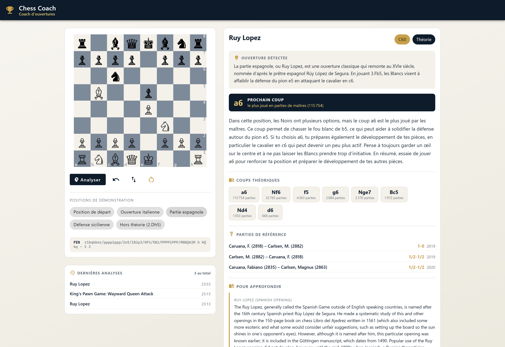
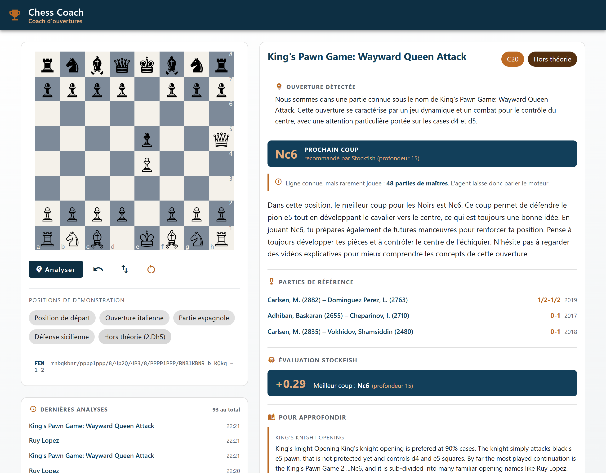
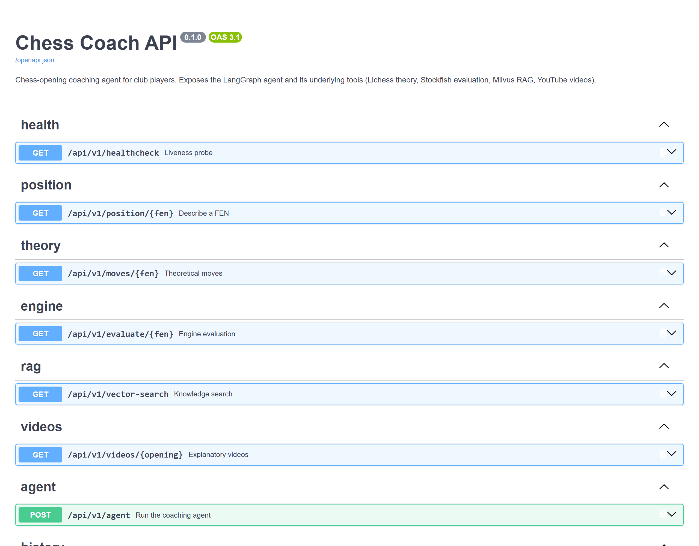

# Chess opening coach

An agent that helps a young player work on their openings. Give it a position; it finds
the theory, the master games behind it, an explanatory article and a video — and when the
position has left theory, it says so and hands over to an engine.



**Project status** — finished, and archived in a runnable state. The whole stack comes up
with one `docker compose up`. The CI is frozen to manual trigger so that nothing here
decays into a red badge on a project nobody maintains.

## The problem

A club coach can look at a position and say three different things depending on what it
is. *This is the Ruy Lopez, and here is the idea behind it.* Or: *this is a sideline,
nobody plays it, let us see what the engine thinks.* Or: *here is a video that explains it
better than I will.*

A language model asked the same question will answer all three at once, fluently, and
invent the move counts. That is the failure mode this repository is arranged against: not
that the model writes badly, but that **it has no way of knowing which of the three
situations it is in**, and no source for the numbers it will quote anyway.

So the model is not the system here. It is the last node of a graph that has already
decided. Theory comes from a database of master games, the evaluation from an engine, the
explanation from a corpus of articles, the videos from a search API. The model is handed
those facts and asked to write four sentences.

Which leaves the two decisions the system actually takes, and this repository is built
around measuring them: **when is a position still theory, and how do you ask a knowledge
base a question it can answer.**

## What it does

Six containers, one command. A LangGraph agent routes a position through four sources and
writes the answer.

```
START → identify → theory ──in theory──→ context → videos → synthesize → persist → END
                     │                      ↑
                     └──out of theory──→ engine
```

- **Theory** — the [Lichess Opening Explorer](https://lichess.org/api#tag/Opening-Explorer)
  over the master-games database, with a local opening book behind it so the agent still
  answers without a token.
- **Engine** — [Stockfish](https://stockfishchess.org/), called only when the position has
  left theory.
- **Context** — retrieval over 32 articles indexed in [Milvus](https://milvus.io/):
  21 [Wikichess](https://ficgs.com/wikichess.html) pages in English and 11 notes written
  in French, 146 chunks, embedded with a multilingual sentence-transformer. FICGS keeps
  every right on the text of its site, so the pages themselves are not in this
  repository; one command downloads them again.
- **Videos** — the YouTube Data API.
- **Synthesis** — an OpenAI-compatible model writes the recommendation from those facts
  and nothing else. Without a key, or when the call fails, a deterministic French template
  takes over and the agent still answers.

Every analysis is written to MongoDB, so the last positions looked at come back in the
interface.

When the position is not theory, the same screen changes source and says so:



Eight routes, documented by the generated OpenAPI schema:



## The result

### Asking the knowledge base the right way is worth 36 points of recall

Retrieval is scored on 14 hand-written questions, each labelled with the article that
should come back — a hard label, no judge. Four query formulations, same corpus, same
index:

| Variant | recall@1 | recall@3 | MRR |
|---|---|---|---|
| `name-only` — the opening name alone | 0.93 | 1.00 | 0.964 |
| **`french-question`** — what the agent sends | **0.93** | **1.00** | **0.964** |
| `english-verbose` — "chess opening X: main ideas, plans and typical moves" | 0.57 | 0.79 | 0.721 |
| `name-and-eco` — the name plus its ECO code | 1.00 | 1.00 | 1.000 |

**Padding the query is what hurts.** The verbose English wording drops recall@1 from 0.93
to 0.57 — five questions out of fourteen. Its generic words are exactly the vocabulary
every article of the corpus shares, so it pulls the most general pages to the top: asked
about the Ruy Lopez it returns the King's Pawn article, and the London System falls to
rank 7.

**The French wording is not what helps.** It scores exactly the same as the bare opening
name, case for case. What matters is not the phrasing, it is not drowning the name.

**Adding the ECO code takes it to 14 out of 14** — and that is one question better than
what ships. On 14 cases one question is worth 0.07 of recall, so this is inside the noise
and is *not* claimed as an improvement. It is left in the table because a promising lead
that cannot be established is worth publishing too.

Reproduce it: `data/eval/ablation_retrieval.md`, regenerated by
`scripts/run_retrieval_ablation.py`.

### The routing threshold sits on a plateau

`theory_min_games = 1000` is the agent's only conditional edge: above it the answer comes
from theory, below it Stockfish is called and the wording changes. It was set from two
positions looked at by hand.

Swept over a frozen reading of 54 positions — main lines at five depths, plus eight lines
nobody plays:

| Threshold | In theory | Positions that flipped |
|---|---|---|
| 100 | 48 | 1 |
| 500 | 47 | 0 |
| **1 000** *(served)* | **45** | 2 |
| 2 500 | 45 | 0 |
| 5 000 | 45 | 0 |
| 10 000 | 41 | 4 |
| 25 000 | 28 | 13 |

**Divide the served threshold by three and two positions out of 54 change side; multiply
it by three and none do.** The routing is flat from 500 to 5 000, which is where the
number sits. It was chosen from two examples and it happens to be robust — that is a
result worth having, and it is not the one the method deserved.

The reading is dated and versioned (`data/eval/theory_positions.json`) because the
Explorer is a living database: the counts move, and a sweep that queried it live would
never replay.

### What a question costs

Measured inside the deployed configuration, four positions, three repeats:

| Node | Median | p90 |
|---|---|---|
| `context` — embedding + Milvus | **18 ms** | 20 ms |
| `theory` — Lichess Explorer | 76 ms | 80 ms |
| `videos` — YouTube Data API | 276 ms | 312 ms |
| `engine` — Stockfish, depth 15 | **346 ms** | 392 ms |

The retrieval — the part one worries about on a stack with a vector database — is the
cheapest node by a factor of four. What a request costs is the engine and YouTube, and
the engine only runs when the position has left theory.

The language model is excluded: it is billed per call, and the variance of a third-party
endpoint would swamp everything else. In practice it is the dominant cost of a real
request.

## Why these numbers can be believed

**The retrieval claim already existed, and had no artefact.** The docstring of
`build_context_query` asserted that a short French question beats a padded English one,
and the commit that introduced it said "verified on six openings". The observation was
right — the ablation above confirms it and puts 36 points on it — but nothing in the
repository recorded which six openings, what came back, or what was compared to what.
Nobody could replay it, and nothing would have said when it stopped being true.

**The evaluation questions are written by hand, never generated from their target.** A
question drawn from the article it is supposed to retrieve measures string matching, not
retrieval. The label is the file name, so the score needs no judge and costs nothing.

**Several files can be right for one opening.** The corpus holds two Ruy Lopez articles and
a French note on the same opening; the label is a set. Scoring against one of them picked
arbitrarily would punish a retrieval that returned the other, which is not a defect.

**Chunks are deduplicated before the cut at k.** An article is indexed as several
fragments, so one opening can occupy an entire top-3. Counting fragments would inflate
recall at every k and make the ablation compare noise.

**Warnings are errors.** The test configuration used to silence `DeprecationWarning`,
`UserWarning` and `PendingDeprecationWarning` wholesale, on a stack made of six libraries
that move fast. Switching to `filterwarnings = ["error"]` surfaced one on the first run:
starlette 1.3 asks for `httpx2` in its test client and falls back to `httpx` with a
deprecation. The deprecation is followed rather than silenced, and the suite needs no
exemption at all.

**87 tests, no network.** Every external service is faked, and the only test that needs the
downloaded corpus skips when it is absent. Three of them guard the evaluation itself: that
no case points at an article the corpus cannot hold, that the `french-question` variant
calls the agent's own function rather than a copy of it, and that raising the threshold
never puts *more* positions into theory.

## Running it

Docker Desktop must be running.

```powershell
copy .env.example .env       # optional keys: Lichess, YouTube, a language model
docker compose up -d --build

# download the Wikichess articles, which are not redistributed here — see Licence and data
docker compose run --rm backend python -m scripts.fetch_wikichess

# load the knowledge base into Milvus, once — the volume keeps it
docker compose run --rm backend python -m scripts.ingest_wikichess
```

- Interface — <http://localhost:4200>
- API documentation — <http://localhost:8000/docs>

Everything works without a single key: the local opening book replaces the Explorer, the
template replaces the model, and the videos section stays empty. What each missing key
costs is in [`docs/architecture.md`](docs/architecture.md).

Reproduce the measurements:

```powershell
cd backend
uv sync --extra dev
uv run python -m scripts.run_retrieval_ablation     # needs the stack up and ingested
uv run python -m scripts.sweep_theory_threshold     # reads the frozen Explorer reading
uv run python -m scripts.sample_theory_positions    # re-takes that reading; needs a token
docker compose exec backend python -m scripts.bench_agent
```

Checks: `uv run pytest` (87 tests), `uv run ruff check .`,
`uv run bandit -c pyproject.toml -r src`, and `npm test -- --watch=false
--browsers=ChromeHeadless` in `frontend/`.

## Structure

```
├── backend/
│   ├── data/
│   │   ├── wikichess/        the index of the 21 FICGS articles, downloaded on demand
│   │   ├── openings/         11 notes written in French, the local opening book's prose
│   │   └── eval/             the published measurements and the cases behind them
│   ├── scripts/              ingestion, the three measurement scripts, the PDF build
│   ├── src/chess_coach/
│   │   ├── agent/            LangGraph state, nodes, graph, synthesis
│   │   ├── api/              FastAPI routes and schemas
│   │   ├── evaluation/       the metrics, the query variants, the threshold sweep
│   │   ├── rag/              chunking and indexing
│   │   ├── services/         Lichess, Stockfish, YouTube, Milvus, MongoDB, the opening book
│   │   └── config.py         every tunable, read from the environment
│   └── tests/                87 tests, no network
├── frontend/                 Angular Material and ngx-chess-board
├── docs/                     architecture, and a feasibility study on video analysis
├── notebooks/                the walkthrough, from ingestion to the agent
└── docker-compose.yml        the six services
```

Python 3.12 · FastAPI · LangGraph · Milvus · MongoDB · Stockfish · sentence-transformers ·
Angular 17 · Angular Material · nginx · uv · Docker.

## What this does not prove

**Fourteen questions is a small set.** One question is worth 0.07 of recall, so the
ablation separates a wide gap from a narrow one and nothing finer. It is enough to
establish that padding the query costs five questions; it is not enough to rank the three
variants that scored within one case of each other.

**Thirty-two articles is a small corpus.** On a base this size the right answer is often
within reach, and a high recall@3 says more about the corpus than about the retrieval.
What remains measurable — and is measured — is the sensitivity to how the question is
worded.

**Nothing here checks that the model obeys.** The prompt forbids inventing a move and
forbids mentioning the engine when no evaluation was requested. That is the right
instruction in the right place, and a test with a faked model can only verify that the
*prompt* carries it. Measuring compliance means running a real model over the evaluation
positions and counting the moves it cites outside the list it was given — designed, costed,
and not run: the calls are billed and the decision to spend belongs to whoever owns the
key.

**The corpus is taken as it comes.** The Wikichess articles are indexed with their source
and their contributors, and this repository measures which one is returned, not whether
what it says is right.

**Nothing measures the quality of the written answer.** It would take a judge, and a judge
mostly measures the judge.

## Licence and data

Code under [MIT](LICENSE).

**No third-party data is redistributed.** The knowledge base is built from
[Wikichess](https://ficgs.com/wikichess.html), and FICGS keeps every right on it: its
terms reserve "the general structure, texts, images, graphism, documents, databases and
every element of the site" and allow copying games only, in PGN. So the 21 articles are
not here. What is here is their index — `backend/data/wikichess/MANIFEST.json`, which
names each one and the page it comes from — and `scripts/fetch_wikichess.py`, which
downloads them again into a folder git ignores. The eleven French notes are written for
this repository.

The Lichess Opening Explorer, Stockfish and the YouTube Data API are called at run time
and each keeps its own terms; no key is shipped. The measurements under `data/eval/` are
derived numbers and carry no third-party content — except the frozen Explorer reading,
which holds counts of public games with the date they were read.
