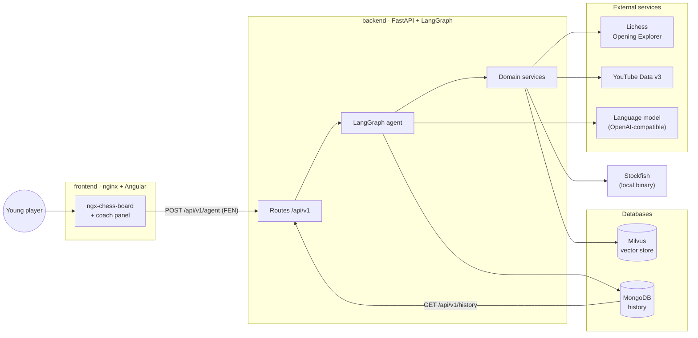
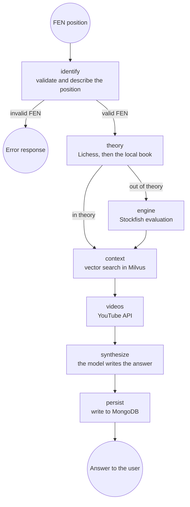
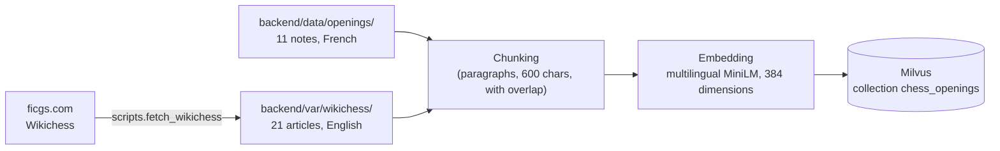

# Architecture

> What runs today. The video-analysis system, which does not exist yet, is described
> separately in `feasibility_video_analysis.md`.

---

## 1. Overview

Six containers, one `docker compose up`.



Milvus itself leans on two infrastructure services, `etcd` for metadata and `minio` for
object storage, both declared in `docker-compose.yml`.

---

## 2. The agent's graph

The agent is a LangGraph decision graph. Each node reads the state, does one thing, and
returns its contribution.



`theory` is the node that **chooses the information source**, and it is the graph's only
conditional edge: established position, give the theory; otherwise, let the engine speak.

The rule is explicit, and it has to be. Lichess's master database answers for almost any
legal position, so it is not the presence of an answer that makes theory but the **number
of games** behind it. The threshold is configurable — `THEORY_MIN_GAMES`, 1 000 by
default: the Italian Game after 3.Bc4 Bc5 rests on 25 559 master games, 1.e4 e5 2.Qh5
on 48, read on 2026-09-07.

That number used to rest on those two examples alone. A sweep has since put a figure on how
much it matters, and the answer is that the branch barely notices a factor of three either
way. The README shows the rows around the served value, `protocol.md` says how the sweep was
built, and `../backend/reports/theory_threshold_sweep.md` holds the whole curve.

The move the interface puts forward follows the same rule: inside theory, the one most
played in master games; outside it, Stockfish's. The language model is told which one was
chosen, so that it comments on the move the player actually has in front of them.

When a position falls below the threshold, Lichess's answer is kept anyway. It often
carries a name and a game count, and *"Scholar's Attack, 48 master games"* teaches a player
more than *"unknown position"* — the point being precisely that the line exists and nobody
plays it.

The state accumulates the list of tools actually used (`sources_used`), which the interface
shows under the answer.

---

## 3. The backend's layers

```
backend/src/chess_coach/
├── api/          # transport: thin routes, validation, HTTP codes
├── agent/        # orchestration: state, nodes, graph, synthesis
├── rag/          # chunking and indexing of the corpus
├── evaluation/   # metrics, query variants, threshold sweep
├── services/     # domain: one module per external system
└── config.py     # settings, read from the environment
```

The dependency rule runs one way only: `api` and `agent` call `services`, never the
reverse. That is what lets the agent be tested against fake services, with no network and
no container. `evaluation` depends on both and nothing depends on it.

| Service | Role | Behaviour when it fails |
| --- | --- | --- |
| `lichess` | Theoretical moves and reference games | Error raised, the local book takes over |
| `opening_book` | Local, offline opening book | Always available |
| `theory` | Chooses between the two sources | not applicable |
| `stockfish_engine` | Evaluation and best move | 502 on its own route |
| `embeddings` | Text vectorisation | Model loaded once |
| `milvus_store` | Vector collection | 503 on its own route |
| `rag_search` | Embeds the question, then queries Milvus | Empty passages |
| `youtube` | Video search | Empty list, the rest of the answer stands |
| `mongo` | History | Write ignored, read empty |

Which is what makes the whole stack work with no key at all: the local book replaces the
Explorer, the deterministic template replaces the model, and the videos section stays
empty. What each missing key costs is one row of that table.

---

## 4. The knowledge base



32 articles in two folders. The Wikichess pages are not redistributed with this
repository, because FICGS keeps every right on the text of its site, so the download is what
fills that folder, once, before the first ingestion; what is versioned is the manifest
that lists which articles the corpus is made of. Each indexed passage carries the name of its
folder, which is how the interface can say where an answer came from and how the ablation can
score against a label it did not have to guess.

The corpus is deliberately bilingual: the Wikichess pages are English, the complementary
notes are French, and the queries are French. That is why the embedding model is
multilingual, and it is the reason a badly worded query hurts here more than it would on a
single-language corpus — the ablation puts 36 points of recall on it.

---

## 5. The path of one request

1. The player makes a move; `ngx-chess-board` returns the FEN.
2. The Angular component calls `POST /api/v1/agent` on a relative path.
3. nginx forwards to the backend over the internal Docker network.
4. The graph runs: validation, theory or engine, context, videos.
5. The language model writes the recommendation from those facts and nothing else.
6. The interaction is written to MongoDB.
7. The interface renders, in this order: the detected opening with its ECO code, two or
   three sentences presenting it, the next move put forward, the recommendation, the
   theoretical moves, the reference games, the engine evaluation, the retrieved passages,
   the videos, and the tools the agent actually used.

Measured inside the deployed configuration: 18 ms for the vector search, 76 ms for the
Explorer, 276 ms for YouTube, 346 ms for Stockfish. The language model is excluded — it is
billed per call, and in practice it dominates a real request.

---

## 6. Configuration and persistence

Nothing is hard-coded. Every setting goes through an environment variable, gathered in
`config.py` and documented in `.env.example`.

Five named volumes keep the state between restarts:

| Volume | Contents |
| --- | --- |
| `milvus_data` | The indexed vector store |
| `etcd_data` | Milvus metadata |
| `minio_data` | Milvus object storage |
| `mongo_data` | The interaction history |
| `hf_cache` | The downloaded embedding model |

That is what lets the demonstration restart without re-ingesting the corpus or losing the
history.

---

## 7. What was considered and not built

An architecture document that lists only what exists reads as though nothing else was ever on
the table. Four things were, and each was set aside for a reason that is still the reason.

**A language model asked to answer the question.** The obvious design: hand the position to a
model and let it write. It was rejected before anything was built, and the README says why —
the model has no way of knowing which of three situations it is in, and no source for the
counts it will quote. What is here instead puts the model last, after the routing has been
decided by a database and an engine, and `docs/protocol.md` measures what that buys.

**A fine-tuned model instead of retrieval.** Thirty-two articles is not a training set. It is
also the wrong shape of problem: the corpus changes when an article is added, and a retrieval
index absorbs that in one ingestion while a fine-tune absorbs it in another training run. The
cost of being wrong is asymmetric too — a retrieval that misses returns the wrong article,
visibly, with its source; a fine-tune that misses invents.

**An agent that chooses its own tools.** LangGraph supports a model deciding which tool to
call. The graph here is a fixed sequence with one conditional edge, and that edge is a
comparison between an integer and a threshold. Giving the choice to a model would have made the
routing unmeasurable: `docs/protocol.md` sweeps the threshold over fifty-four positions and
reports how many change side, which is a question one cannot ask about a prompt.

**Video analysis.** The project was asked whether the coach could watch the videos it
recommends and point at the moment an opening is explained. The study is
[`feasibility_video_analysis.md`](feasibility_video_analysis.md), and its answer is that it is
feasible and out of proportion: transcription, alignment and indexing for a corpus of eleven
openings, against a retrieval that already answers in eighteen milliseconds. Nothing of it is
built. The study is kept because the decision not to build it is part of the design, and
because the reasoning would otherwise have to be redone by whoever asks next.
