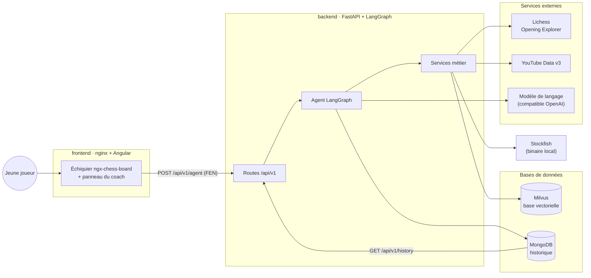
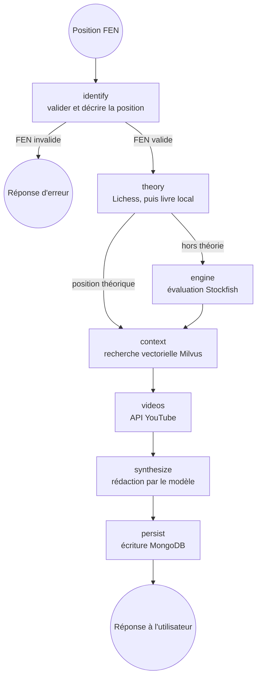
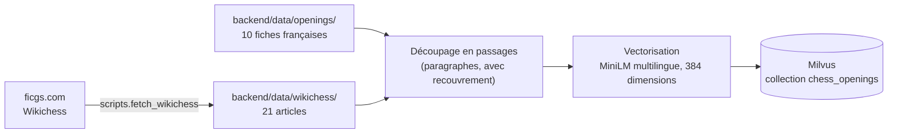

# Architecture du POC

> Chess Coach — agent d'aide à l'apprentissage des ouvertures
> des Échecs. Ce document décrit ce qui tourne aujourd'hui. L'architecture du
> système d'analyse vidéo, qui reste à construire, est décrite séparément dans
> `feasibility_video_analysis.md`.

---

## 1. Vue d'ensemble

Six conteneurs, orchestrés par un seul `docker compose up`.



Milvus s'appuie lui-même sur deux services d'infrastructure, `etcd` (métadonnées)
et `minio` (stockage objet), déclarés dans le `docker-compose.yml`.

---

## 2. Le graphe de l'agent

L'agent est un graphe de décision LangGraph. Chaque nœud lit l'état, fait une
seule chose, et renvoie sa contribution.



Le nœud `theory` est celui qui **choisit la source d'information** : si la position
est établie, on donne la théorie ; sinon, on laisse parler le moteur.

La règle est explicite. La base de parties de maîtres de Lichess répond pour
presque n'importe quelle position légale ; ce n'est donc pas la présence d'une
réponse qui fait la théorie, mais le **nombre de parties** qui la soutiennent.
Le seuil est réglable (`THEORY_MIN_GAMES`, 1 000 par défaut) : l'ouverture
italienne s'appuie sur environ 49 000 parties, la sortie de dame 2.Dh5 sur 48.

Le coup mis en avant par l'interface suit la même règle : dans la théorie,
c'est le coup le plus joué en parties de maîtres ; hors théorie, celui que
recommande Stockfish. Le modèle de langage est informé de ce choix, pour qu'il
commente le coup que le joueur a effectivement sous les yeux.

Quand la position tombe sous le seuil, la réponse de Lichess est tout de même
conservée. Elle porte souvent un nom et un compte de parties, et « attaque du
berger, 48 parties de maîtres » apprend davantage au joueur que « position
inconnue » : le propos est justement que la ligne existe mais que personne ne
la joue.

L'état accumule au passage la liste des outils réellement utilisés
(`sources_used`), ce que l'interface affiche sous la réponse.

---

## 3. Les couches du backend

```
backend/src/chess_coach/
├── api/          # transport : routes fines, validation, codes HTTP
├── agent/        # orchestration : état, nœuds, graphe, synthèse
├── rag/          # préparation et indexation du corpus
├── services/     # métier : un module par système externe
└── config.py     # réglages, lus dans l'environnement
```

La règle de dépendance ne va que dans un sens : `api` et `agent` appellent
`services`, jamais l'inverse. C'est ce qui permet de tester l'agent avec des
services factices, sans réseau ni conteneur.

| Service | Rôle | Comportement en cas de panne |
| --- | --- | --- |
| `lichess` | Coups théoriques et parties de référence | Erreur remontée, le livre local prend la suite |
| `opening_book` | Livre d'ouvertures local, hors ligne | Toujours disponible |
| `theory` | Choisit entre les deux sources | — |
| `stockfish_engine` | Évaluation et meilleur coup | Erreur 502 sur la route dédiée |
| `embeddings` | Vectorisation des textes | Modèle chargé une seule fois |
| `milvus_store` | Collection vectorielle | Erreur 503 sur la route dédiée |
| `rag_search` | Vectorise la question puis interroge Milvus | Passages vides |
| `youtube` | Recherche de vidéos | Liste vide, le reste de la réponse tient |
| `mongo` | Historique | Écriture ignorée, lecture vide |

---

## 4. La base de connaissances



Le téléchargement se fait une seule fois et son résultat est versionné :
l'indexation dans Milvus ne dépend jamais du réseau. Chaque passage conserve le
nom de son dossier d'origine, ce qui permet de citer sa provenance dans
l'interface.

---

## 5. Le chemin d'une requête

1. Le joueur joue un coup ; `ngx-chess-board` renvoie la FEN.
2. Le composant Angular appelle `POST /api/v1/agent` sur un chemin relatif.
3. nginx relaie vers le backend sur le réseau Docker interne.
4. Le graphe s'exécute : validation, théorie ou moteur, contexte, vidéos.
5. Le modèle de langage rédige la recommandation à partir de ces seuls faits.
6. L'interaction est écrite dans MongoDB.
7. L'interface affiche, dans cet ordre : l'ouverture détectée avec son code
   ECO, une présentation de cette ouverture en deux ou trois phrases, le
   prochain coup mis en avant, la recommandation, les coups théoriques, les
   parties de référence, l'évaluation du moteur, les passages retrouvés, les
   vidéos, et les outils que l'agent a réellement utilisés.

---

## 6. Configuration et persistance

Aucune valeur n'est écrite en dur. Tous les réglages passent par des variables
d'environnement, rassemblées dans `config.py` et documentées dans `.env.example`.

Cinq volumes nommés conservent l'état d'un redémarrage à l'autre :

| Volume | Contenu |
| --- | --- |
| `milvus_data` | La base vectorielle indexée |
| `etcd_data` | Les métadonnées de Milvus |
| `minio_data` | Le stockage objet de Milvus |
| `mongo_data` | L'historique des interactions |
| `hf_cache` | Le modèle d'embedding téléchargé |

C'est ce qui permet de relancer la démonstration sans réingérer le corpus ni
perdre l'historique.
