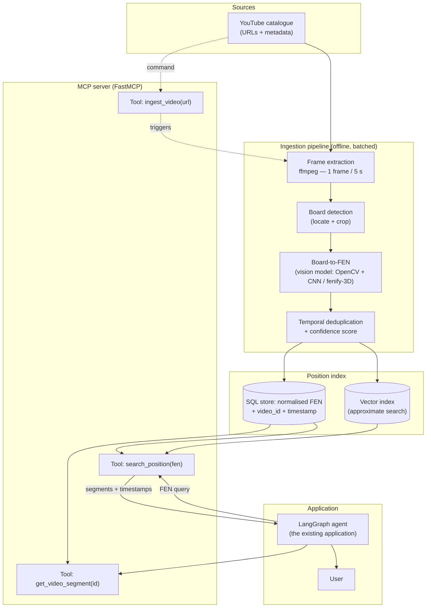

# Feasibility note — video analysis for position search

> Video analysis for a chess agent
> Preparatory technical note — design of an advanced position-indexed video module
> Version 1.0 — June 2026

---

## 1. Context and objective

The chess agent today helps players by analysing a game in progress, suggesting moves,
explaining plans, and pointing them at learning material. Video sits at the centre of that
material: YouTube holds a considerable amount of teaching content — grandmaster analyses,
opening courses, theoretical endgames, annotated games. The agent already recommends
videos, but it does so through a **plain text query** sent to the YouTube search API.

That approach runs out of road quickly. When a user is facing a specific position — a
Sicilian Najdorf structure after the fifteenth move, say — the agent can only return a
*thematic* video: "Understanding the Najdorf", forty-five minutes long. The user then has
to scrub through it to maybe find the relevant passage. The real need is not "a video about
the Sicilian" but **"the explanation of THIS position, at THIS exact second"**. The gap
between the granularity of the search (a video title) and the granularity of the need (a
moment inside a video) is the problem this note addresses.

**What the proposed system does.** Analyse a catalogue of teaching videos, automatically
extract the chess positions displayed on screen, convert them to **FEN**
(*Forsyth–Edwards Notation*), and index them so that every position is bound to a
`(video, timestamp)` pair. The existing agent could then query the module with the
**exact position** of the game in progress and receive a video link pointing straight at
the second where that position is explained.

This document is a **design feasibility note**: it describes the system, its target
architecture around an **MCP (Model Context Protocol)** server, its benefits, its limits,
its forecast costs (CAPEX/OPEX), its risks, alternatives, and a roadmap. It is not a
software delivery; no development is committed at this stage.

**Scope.** The system targets videos showing a **synthetic 2D board** — diagrams generated
by an analysis tool such as Lichess, Chess.com or ChessBase — which is the overwhelming
majority of teaching content. Physical boards filmed in perspective and stylised 3D pieces
are treated as degraded cases (see §5).

---

## 2. Functional description

The system provides two functionally distinct services, which correspond to two very
different execution regimes: **ingestion** (offline, batched) and **query** (online, real
time).

### 2.1 Catalogue ingestion (offline)

1. **Catalogue management.** A list of YouTube URLs is maintained (video ids, metadata:
   title, author, language, topic, licence). It can be enriched by hand or by automatic
   discovery over a vetted set of channels.
2. **Fetching the stream.** For each video, the stream is fetched at a resolution
   sufficient to read the board — 720p is ample for a 2D diagram.
3. **Frame sampling.** Using **ffmpeg**, one image is extracted at a fixed interval
   (reference rate: **one frame every 5 seconds**). A chess position stays on screen for
   several seconds; sampling every frame would be pointless and expensive.
4. **Board detection.** On each frame, a detector locates the region holding a board
   (cropping, perspective correction where needed). Frames with no board — the
   commentator's face, a title card, an advert — are discarded.
5. **Board-to-FEN conversion.** A **vision model** (something like *fenify-3D*, or an
   OpenCV grid-detection pipeline followed by a CNN classifying the 64 squares) recognises
   the piece on each square and produces a FEN string describing the position.
6. **Temporal deduplication.** This is structural, not an implementation detail. A teacher
   commenting on one position for eight minutes leaves the same diagram on screen: at one
   frame every five seconds, that single position would produce **96 identical records**,
   and the user would be offered the same video 96 times. Consecutive frames describing
   the same position are therefore collapsed into a single record, which keeps the
   **timestamp of first appearance** — the moment the teacher starts talking about it,
   which is exactly where the user should be sent. A position that reappears later in the
   video, after several others, is a new record: the teacher has come back to it for a
   different reason.

   What is returned to the user is never a frame. The frame is a processing artefact,
   deleted after extraction; what matters is the **(video, timestamp) pair**, rendered as
   a timestamped link.
7. **Indexing.** Each position is stored as
   `(FEN, video_id, start_timestamp, end_timestamp, confidence, metadata)` in a queryable
   store.

### 2.2 Position query (online)

From the existing agent:

1. The agent knows the **current position** — it already holds it as a FEN in its state.
2. It calls the module's search tool with that FEN.
3. The module queries the index and returns the video segments matching that position, or
   one very close to it, sorted by relevance and source quality.
4. The agent gives the user a **deep link** of the form
   `https://youtu.be/<id>?t=<seconds>`, with the title and the author.

The granularity drops from "a video" to "a second inside a video", which is the problem
stated in §1.

### 2.3 Normalisation and tolerance

A full FEN carries the side to move, castling rights, the en-passant square and the move
counters. For a teaching search only the **piece placement** — the first FEN field — and
ideally the side to move are relevant, so what is indexed is a **normalised key**
(placement + side to move). **Exact position** search is the main function; **approximate**
search (positions one or two moves away, or identical pawn structures) is planned as an
extension, to absorb small recognition errors and widen recall.

---

## 3. Technical architecture (MCP server)

The architecture separates the **ingestion chain** (batched, compute-hungry) from the
**query chain** (light, real time), the two meeting on a shared **position index**.
Exposure to the agent goes through an **MCP server** implemented with **FastMCP**, which
presents standardised tools decoupled from the internals.

### 3.1 Architecture diagram

### 3.2 The same thing in words

`YouTube catalogue` → `ffmpeg (1 frame / 5 s)` → `board detection (crop / perspective)` →
`board-to-FEN (vision model)` → `deduplication + confidence` → `index (SQL FEN+timestamp
and vector index)`. Alongside, the **MCP server** reads that index and exposes three tools.
The **LangGraph agent** calls `search_position(fen)` with the current position, receives a
list of `(video, timestamp)` segments, and hands the **user** a timestamped link. The
ingestion command `ingest_video(url)` pushes a new video back to the head of the pipeline.

### 3.3 Components

- **Catalogue manager**: a table of videos (id, URL, title, author, language, topic,
  licence, ingestion status, last processed). It doubles as the work queue.
- **Frame extractor (ffmpeg)**: invoked with a rate filter (`-vf fps=1/5`), it produces the
  images without decoding the whole stream at full rate. CPU step.
- **Board detector**: finds the 8×8 grid, fixes orientation and framing. For a 2D diagram,
  contour and line detection (Hough / OpenCV) is enough; for a filmed board, a homography
  is estimated.
- **Board-to-FEN model**: the heart of the system. Cuts the board into 64 squares and
  classifies each into 13 states (6 pieces × 2 colours + empty). Emits the FEN and an
  aggregate **confidence score**.
- **Deduplication module**: compares successive FENs, merges repeats, keeps the first
  timestamp and the highest confidence.
- **Position index**: a **SQL** store (`positions` table) for exact-key lookup on the
  indexed normalised FEN; an optional **vector index** encoding the position (a 64-square
  vector, or a structure embedding) for approximate search.
- **MCP server (FastMCP)**: the exposure layer. It holds no heavy domain logic; it
  translates tool calls into index queries or ingestion commands.

### 3.4 Exposed MCP tools

| Tool | Input | Output | Use |
|---|---|---|---|
| `search_position` | `fen` (placement + side to move), optional `tolerance` | list of `{video_id, title, author, timestamp, timestamped_url, score}` | Called by the agent with the current position |
| `get_video_segment` | `video_id`, `timestamp` | segment metadata, deep link, context (neighbouring positions) | Building what the user sees |
| `ingest_video` | `url` or `video_id` | ingestion status (queued/running/done), positions extracted | Catalogue administration |

### 3.5 Data flow: ingestion versus query

- **Ingestion**: asynchronous, batched, triggered when a video is added or on a schedule.
  Consumes **GPU** (board-to-FEN) and **CPU** (ffmpeg). Writes to the index. Latency is not
  critical — minutes per video are fine.
- **Query**: synchronous, triggered by the agent. Consumes almost no compute (one indexed
  read). Latency is critical: **target below 200 ms**, so that it stays invisible inside
  the conversation.

That separation is what guarantees the GPU cost never touches the user's response time:
all the heavy work happens once, upstream.

---

## 4. Expected benefits

- **Surgical relevance.** The user gets the exact *second* where their position is
  explained, instead of a whole video to scrub through. That is the central, differentiating
  gain.
- **Reuse of the agent's state.** The agent already holds the FEN of the game in progress;
  the user is asked for nothing extra. The integration is natural.
- **Decoupling through MCP.** Exposing the module over MCP isolates it from the agent's
  internals. The same server could serve other clients — a web interface, another
  assistant — with no rewrite.
- **Value drawn from existing material.** Thousands of hours of good teaching sit on
  YouTube with no fine-grained index. The system creates a position-level access layer that
  exists nowhere else.
- **Incremental accumulation.** Every ingested video enriches the index permanently. Value
  grows with the catalogue, at a low marginal ingestion cost (see §6).
- **Approximate search later.** Beyond the exact position, the vector index opens the way
  to "show me videos about similar pawn structures", which is a strong teaching feature.
- **Measurability.** Coverage — the share of current positions actually found in the index
  — and board-to-FEN accuracy are trackable metrics, which turn the delivered value into a
  number.

---

## 5. Technical and business limits

- **Board-to-FEN accuracy.** This is the dominant risk. A single misclassified square
  produces a wrong FEN, hence a missing or wrong index key. 2D models on clean diagrams
  reach very high per-square accuracy, often above 99 %, but at 99 % per square a position
  with 32 occupied squares has roughly a 0.99³² ≈ **72 %** chance of being *entirely*
  correct. A confidence score and a rejection threshold are therefore not optional if the
  index is to stay clean.
- **Visual diversity.** Board colour themes, piece sets, overlays (arrows, highlighted
  squares, channel branding), banners and logos all disturb the classifier. Each style may
  need adaptation or partial retraining.
- **Camera angles and 3D pieces.** Videos of physical boards filmed in perspective, and
  stylised 3D renders, degrade reliability sharply. They are out of the priority scope and
  would be handled later, or dropped.
- **Storage volume.** Under control as long as raw frames are not kept. See the arithmetic
  in §6: the index itself is light — a few gigabytes — and the temporary frames dominate but
  are deletable after processing.
- **GPU cost.** Board-to-FEN inference over the whole catalogue is the expensive step. It
  stays modest in absolute terms (see §6) because it is one-off and parallelisable.
- **Copyright and YouTube's terms.** A **sensitive business point**. Downloading and storing
  frames from third-party videos touches copyright and YouTube's terms of use. Recommended
  strategy: do **not** redistribute the content; keep only the FEN and the timestamp
  durably (*factual* data, not protectable); delete the frames after extraction; and return
  only a **deep link** to the original video, so the creator keeps the views and the
  monetisation. A legal review is needed before industrialisation.
- **Catalogue maintenance.** Videos get deleted, turned private, or re-uploaded with URLs
  and timestamps that no longer hold. Periodic link validation and a re-ingestion policy are
  required.
- **Ingestion latency versus freshness.** A newly published video is only searchable after
  it has gone through the pipeline. Acceptable for teaching use, but it must be documented.
- **Incomplete coverage.** Not every position appears in a video. The system is a
  **complement** with real added value, not a guarantee of an answer to every query. A
  fallback — the classic text search — has to stay available.

---

## 6. Feasibility and cost estimate

### 6.1 Sizing assumptions

| Parameter | Value used | Why |
|---|---|---|
| Initial catalogue size | **1 000 videos** | Covers the main French- and English-language teaching channels |
| Average video length | **12 min** = 720 s | Typical order of magnitude for a course or analysis |
| Sampling rate | **1 frame / 5 s** | A position stays on screen for several seconds |
| Working resolution | 720p, JPEG ~**150 KB**/frame | Enough to read a 2D diagram |
| Share of frames holding a board | **~40 %** | The rest: commentator, titles, transitions |
| Unique positions after deduplication | **~12 / video** | A video runs through a limited number of key positions |
| Board-to-FEN inference (detection + 64 squares) | **~0.2 s/frame** on a GPU T4 | Detection + CNN pipeline |
| Object storage | **€0.02/GB/month** | Standard S3/Blob pricing, 2026 |
| GPU T4 | **€0.40/h** | On-demand cloud instance, 2026 |
| Loaded day rate | **€450/day** | Junior engineer, employer cost |

### 6.2 Order-of-magnitude arithmetic

**Frames extracted**: 720 s ÷ 5 s = **144 frames/video**, so 144 × 1 000 = **144 000
frames** for the catalogue.

**Frames holding a board**: 144 000 × 40 % ≈ **57 600 frames** actually worth running
board-to-FEN on. The others are dropped early, but the compute is budgeted over the whole
set to stay on the safe side.

**Indexed positions**: 12 × 1 000 = **~12 000** unique positions. That is the system's unit
of value.

**Storage.** Keeping *every* frame would be 144 000 × 150 KB ≈ **21.6 GB** — well under a
terabyte. In practice frames are **deleted once the FEN is extracted**; at most one
thumbnail per indexed position is kept: 12 000 × 150 KB ≈ **1.8 GB**. The SQL index (FEN +
metadata) weighs a few tens of megabytes. **Durable storage budget: ~2 GB.** Volume is not
the limiting factor.

**Ingestion GPU (initial catalogue)**: 144 000 frames × 0.2 s = 28 800 s ≈ **8 GPU hours**.
With margin for retries, double-cropped frames and overhead: **~12 GPU hours**. At €0.40/h
that is **~€5** to process all 1 000 videos. Counter-intuitively, the GPU cost is
**negligible**; the ffmpeg extraction (CPU) is of the same order.

### 6.3 Setup costs — CAPEX

| Item | Description | Days | Cost (€) |
|---|---|---:|---:|
| Vision model R&D | Selecting and evaluating board-to-FEN, fine-tuning on diagram styles, annotated test set, confidence thresholds | 25 | 11 250 |
| Ingestion pipeline | Catalogue, ffmpeg extraction, batch orchestration, deduplication | 15 | 6 750 |
| Position index | SQL schema, FEN normalisation, vector index, queries | 10 | 4 500 |
| MCP server (FastMCP) | `search_position`, `get_video_segment`, `ingest_video`, tests | 12 | 5 400 |
| LangGraph integration | Wiring the tool into the agent, rendering timestamped links | 8 | 3 600 |
| Evaluation and quality | Precision/recall metrics, validation set, test bench | 10 | 4 500 |
| Documentation and deployment | Technical doc, CI/CD, first production rollout | 5 | 2 250 |
| **Labour subtotal** | | **85 d** | **38 250** |
| Initial infrastructure and R&D | Development GPU (~150 h), storage, environments | — | 2 000 |
| **CAPEX TOTAL** | | | **≈ €40 250** |

### 6.4 Monthly running costs — OPEX

Growth assumption: **+200 new videos a month** ingested, plus a partial control
re-ingestion.

| Item | Basis | Monthly (€) |
|---|---|---:|
| Object storage (index + thumbnails) | ~2 GB × €0.02/GB, growing ~0.4 GB/month | ~1 |
| Ingestion GPU | 200 videos × 144 frames × 0.2 s ≈ 1.6 h + margin ≈ 5 h × €0.40 | ~2 |
| CPU (ffmpeg) | Download and extraction, on-demand instance | ~5 |
| Managed database | Small managed SQL instance | ~25 |
| MCP server hosting | Small always-on VM (1 vCPU / 1–2 GB) | ~30 |
| YouTube API quota | Data API v3; the free quota is ample at this volume | 0 |
| Monitoring and logs | Basic supervision | ~5 |
| **OPEX TOTAL** | | **≈ €68/month** |

### 6.5 Cost per indexed position

A catalogue of **12 000 positions** in the first year.

- **First year** (CAPEX + 12 months of OPEX): (40 250 + 12 × 68) ÷ 12 000 ≈
  **€3.42/position**.
- **Steady state** (OPEX only, development excluded): ~€816/year ÷ ~14 400 positions, on a
  growing catalogue ≈ **€0.06/position/year**.

**How to read that.** The system is **CAPEX-dominated** — the vision model's R&D — while
**running it is very cheap**: the GPU, against intuition, costs a few euros a month, thanks
to the 1-frame-in-5-seconds sampling and the deduplication. The real recurring cost is
**hosting** (the MCP server and the database), not compute. Against 12 000 positions
searchable at the heart of the user experience, the marginal cost is marginal: **economic**
feasibility is favourable, and the lock is **technical** feasibility — board-to-FEN
accuracy, §5.

---

## 7. Risks

| Risk | Likelihood | Impact | Mitigation |
|---|---|---|---|
| Board-to-FEN not accurate enough (wrong FENs) | High | High | Confidence threshold and rejection of doubtful frames; approximate search to absorb errors; annotated test set and tracked accuracy |
| Uncovered visual styles (overlays, themes) | High | Medium | Multi-style fine-tuning; visual normalisation; restrict the catalogue first to channels with a standard look |
| 3D boards / filmed in perspective | Medium | Medium | Out of priority scope; filtered upstream; those videos flagged as not indexable |
| Copyright / YouTube terms dispute | Medium | High | Store only FEN + timestamp (factual data), delete frames, return deep links only; legal review |
| Broken links / deleted videos | High | Low | Periodic validity check; "unavailable" status; scheduled re-ingestion |
| Coverage too thin (positions absent from the catalogue) | Medium | Medium | Fall back on text search; prioritise ingestion by most-requested topics; measure coverage |
| Query latency too high | Low | Medium | Exact index on the primary key; cache; strict ingestion/query separation |
| Dependence on an external board-to-FEN library | Medium | Medium | Abstract the model behind an interface; keep it replaceable; independent test set |
| Cost drift as the catalogue grows | Low | Low | Costs dominated by fixed hosting; GPU stays linear and small |

---

## 8. Alternatives considered

### 8.1 Alternative A — No vision: YouTube chapters and transcripts

YouTube exposes **chapters** and a **timestamped transcript** (subtitles) for many videos. A
purely textual approach would index those transcripts and search by keyword — "Najdorf",
"the b5 push", move names spoken aloud in algebraic notation.

- **Cost**: very low. No GPU, no vision model, no heavy R&D. CAPEX an order of magnitude
  smaller (~10–15 days).
- **Value**: limited and imprecise. A teacher does not **speak** the full position; they
  talk about plans and moves without enumerating 32 pieces. So an **exact position** cannot
  be found, only a theme — which reproduces, barely refined, the present problem (§1).
- **Verdict**: useful as an **economic base** and as a **fallback**, but it does not solve
  position-level pointing.

### 8.2 Alternative B — Hybrid: transcripts plus targeted vision

Use transcripts and chapters first to **pre-filter** the videos and the relevant passages,
then run the expensive board-to-FEN only on those **sub-segments** rather than on the whole
catalogue.

- **Cost**: intermediate. Sharply reduces the number of frames analysed — the segments
  where a board is probably being discussed — hence the GPU and the annotation effort.
  Moderate CAPEX.
- **Value**: high. It keeps vision's **position-level precision** where it matters, while
  using the free textual signal for coverage and semantic framing (a chapter title is a
  topic).
- **Verdict**: **best value for money**. This is the recommended endpoint: start with pure
  vision on a restricted catalogue to validate accuracy, then switch to the hybrid to scale
  economically.

| Criterion | Proposed solution (vision) | A — Transcripts only | B — Hybrid |
|---|---|---|---|
| Exact position search | Yes | No | Yes |
| CAPEX | High | Low | Medium |
| OPEX | Low | Very low | Low |
| Catalogue coverage | Medium | High | High |
| Technical complexity | High | Low | Medium-high |

---

## 9. Development roadmap

| Phase | Objective | Duration | Milestones | Gate |
|---|---|---|---|---|
| **0 — Framing** | Scope, YouTube legal review, pilot channel selection | 2 weeks | 20–30 pilot videos listed, legal agreement in principle | Scope and compliance validated |
| **1 — POC** | Prove board-to-FEN feasibility on 2D diagrams | 3 weeks | ffmpeg → board-to-FEN pipeline over 20 videos; per-square and per-position accuracy measured | **Position accuracy ≥ 70 %** on the pilot set |
| **2 — MVP** | Full chain: ingestion → index → MCP → agent | 5 weeks | 200 videos ingested; `search_position` / `get_video_segment` working; LangGraph integration; latency < 200 ms | End-to-end demonstration: current position → correct timestamped link |
| **3 — Evaluation** | Measure coverage and precision on real use | 2 weeks | Validation set, coverage rate, false-positive rate; calibrated confidence thresholds | Precision and coverage judged sufficient |
| **4 — Industrialisation** | Scale (1 000+ videos), robustness, operations | 6 weeks | Hybrid approach (§8.2), scheduled ingestion, link validation, monitoring, CI/CD | In production, OPEX under control, supervision active |
| **5 — Extensions** | Approximate search, multi-style, other MCP clients | ongoing | Vector index, similar pawn structures | Backlog prioritised by usage |

Cumulative duration to industrialisation: **~18 weeks** (≈ 4.5 months), consistent with the
85-day estimate in §6 for a small team.

**Why that order.** The **POC** clears risk number one — board-to-FEN accuracy — before any
heavy investment: if it fails, the project stops or falls back to alternative A at low cost.
The **MVP** validates the full chain and the end-to-end user experience. **Industrialisation**
is only committed once the value is demonstrated, and adopts the hybrid approach to keep
cost under control at scale.

---

## 10. Conclusion and recommendation

The proposed video-analysis system answers a **real and precisely identified need**: moving
from "a video about a topic" to "the right second for the exact position". The architecture
around an **MCP server** is sound: it decouples the module cleanly from the existing agent,
separates heavy ingestion (GPU, offline) from light queries (real time), and exposes stable,
reusable tools.

The economics are **favourable**: running cost is low (≈ **€68/month**), dominated by
hosting rather than compute, and in steady state it comes down to a few **cents per indexed
position**. The investment is concentrated in **CAPEX** (≈ **€40k**), which is the vision
model's R&D.

**The lock is not cost, it is accuracy** — board-to-FEN across the diversity of real video
styles. Hence the recommendation: **validate that risk with a POC first** (phase 1, target
position accuracy ≥ 70 %) before committing to industrialisation, then adopt the **hybrid
transcript-plus-vision approach** (alternative B) to scale at the best value for money. A
**fallback to text search** must stay available for positions outside the catalogue.

**Recommendation**: commit to phases 0 and 1 — framing and POC, about five weeks, low cost —
as a **decision gate**. The POC results decide whether to continue to MVP and
industrialisation. The risk is contained, the investment is staged, and the value is
demonstrated before any large-scale rollout.

---

*End of the feasibility note.*
