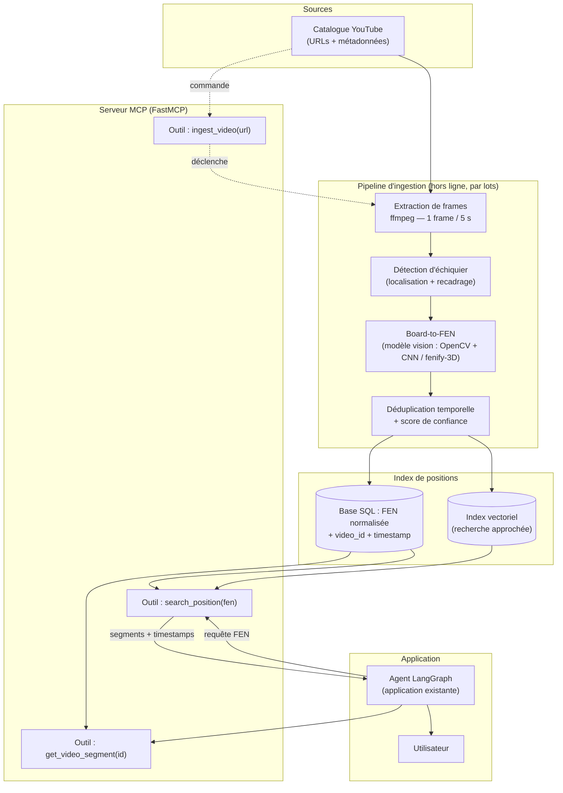

# Note de faisabilité — Système d'analyse vidéo pour la recherche de positions

> Analyse vidéo pour un agent d'échecs
> Note technique préparatoire — conception d'un module avancé d'indexation vidéo par position
> Version 1.0 — Juin 2026

---

## 1. Contexte et objectif

L'agent d'échecs accompagne aujourd'hui les joueurs et joueuses en analysant une partie en cours, en proposant des coups, en expliquant des plans et en orientant l'utilisateur vers des ressources pédagogiques. Parmi ces ressources, la vidéo occupe une place centrale : YouTube concentre une quantité considérable de contenus d'enseignement (analyses de grands maîtres, cours d'ouverture, finales théoriques, parties commentées). L'agent sait déjà recommander des vidéos, mais il le fait via une **requête textuelle classique** envoyée à l'API de recherche YouTube.

Cette approche montre vite ses limites. Lorsqu'un utilisateur affronte une position précise — par exemple une structure de Défense Sicilienne Najdorf après le quinzième coup — l'agent ne peut renvoyer qu'une vidéo *thématique* : « Comprendre la Najdorf », d'une durée de 45 minutes. L'utilisateur doit alors la parcourir manuellement pour, peut-être, retrouver le passage pertinent. Le besoin réel n'est pas « une vidéo sur la Sicilienne » mais **« l'explication de CETTE position, à CETTE seconde précise »**. L'écart entre la granularité de la recherche (un titre de vidéo) et la granularité du besoin (un instant dans une vidéo) constitue le problème central traité par cette note.

**Objectif du système proposé.** Concevoir un module capable d'analyser un catalogue de vidéos pédagogiques, d'en extraire automatiquement les positions d'échiquier affichées à l'écran, de les convertir en notation **FEN** (*Forsyth–Edwards Notation*), puis de les indexer en associant chaque position à un couple `(vidéo, timestamp)`. L'agent existant pourrait alors interroger ce module avec la **position exacte** de la partie en cours et recevoir un lien vidéo pointant directement sur la seconde où cette position est expliquée.

Ce document est une **note de faisabilité de conception** : il décrit le système, son architecture cible autour d'un serveur **MCP (Model Context Protocol)**, ses bénéfices, ses limites, son chiffrage prévisionnel (CAPEX/OPEX), ses risques, des alternatives et une feuille de route. Il ne constitue pas une livraison logicielle ; aucun développement n'est engagé à ce stade.

**Périmètre.** Le système se concentre sur les vidéos affichant un **échiquier 2D synthétique** (diagrammes générés par un logiciel d'analyse type Lichess, Chess.com, ChessBase), qui représentent l'écrasante majorité des contenus pédagogiques. Les échiquiers physiques filmés en perspective et les pièces 3D stylisées sont traités comme cas dégradés (voir §5).

---

## 2. Description fonctionnelle du système

Le système rend deux services fonctionnellement distincts, qui correspondent à deux régimes d'exécution très différents : **l'ingestion** (hors ligne, par lots) et **la requête** (en ligne, temps réel).

### 2.1 Ingestion du catalogue (hors ligne)

1. **Gestion du catalogue.** Une liste d'URL YouTube est maintenue (identifiants de vidéos, métadonnées : titre, auteur, langue, thème, licence). Cette liste peut être enrichie manuellement ou par découverte automatique sur des chaînes de référence validées.
2. **Récupération du flux vidéo.** Pour chaque vidéo, le flux est récupéré dans une résolution suffisante pour lire l'échiquier (720p est largement suffisant pour un diagramme 2D).
3. **Échantillonnage de frames.** À l'aide de **ffmpeg**, on extrait une image à intervalle régulier (cadence de référence : **1 frame toutes les 5 secondes**). Une position d'échecs reste affichée plusieurs secondes à l'écran ; échantillonner chaque image serait inutile et coûteux.
4. **Détection de l'échiquier.** Sur chaque frame, un détecteur localise la région contenant un échiquier (recadrage, correction de perspective si nécessaire). Les frames sans échiquier (visage du commentateur, écran de titre, publicité) sont écartées.
5. **Conversion board-to-FEN.** Un **modèle de vision** (type *fenify-3D*, ou pipeline OpenCV de détection de grille + CNN de classification des 64 cases) reconnaît la pièce présente sur chaque case et produit une chaîne FEN décrivant la position.
6. **Déduplication temporelle.** Les frames consécutives décrivant la même position sont regroupées : on conserve un seul enregistrement par position, avec le **timestamp de première apparition** (l'instant où le formateur commence à parler de cette position).
7. **Indexation.** Chaque position est stockée sous la forme d'un enregistrement `(FEN, video_id, timestamp_début, timestamp_fin, score_confiance, métadonnées)` dans une base interrogeable.

### 2.2 Requête de position (en ligne)

Depuis l'agent existant, le flux est le suivant :

1. L'agent connaît la **position courante** de la partie (il la possède déjà sous forme FEN dans son état interne).
2. Il appelle l'outil de recherche du module en transmettant cette FEN.
3. Le module interroge l'index et renvoie la liste des segments vidéo correspondant à cette position (ou à une position très proche), triés par pertinence et qualité de source.
4. L'agent restitue à l'utilisateur un **lien profond** du type `https://youtu.be/<id>?t=<secondes>`, accompagné du titre et de l'auteur.

La granularité descend ainsi de « une vidéo » à « une seconde dans une vidéo », ce qui répond directement au problème énoncé au §1.

### 2.3 Normalisation et tolérance

La FEN complète comprend le trait, les droits de roque, la case de prise en passant et les compteurs de coups. Pour la recherche pédagogique, seul le **placement des pièces** (premier champ de la FEN) et idéalement le trait sont pertinents : on indexe donc une **clé normalisée** (placement + trait). Une recherche par **position exacte** est la fonction principale ; une recherche **approchée** (positions à un ou deux coups de distance, ou structures de pions identiques) est prévue comme extension afin d'absorber les petites erreurs de reconnaissance et d'élargir le rappel.

---

## 3. Architecture technique (serveur MCP)

L'architecture sépare clairement la **chaîne d'ingestion** (traitement par lots, gourmande en calcul) de la **chaîne de requête** (légère, temps réel), les deux convergeant sur un **index de positions** commun. L'exposition vers l'agent se fait via un **serveur MCP** implémenté avec **FastMCP**, qui présente des outils standardisés et découplés de l'implémentation interne.

### 3.1 Schéma d'architecture

### 3.2 Version texte du schéma

`Catalogue YouTube` → `ffmpeg (extraction 1 frame / 5 s)` → `Détection d'échiquier (recadrage / perspective)` → `Board-to-FEN (modèle vision)` → `Déduplication + score de confiance` → `Index (base SQL FEN+timestamp & index vectoriel)`. En parallèle, le **serveur MCP** lit cet index et expose trois outils. L'**agent LangGraph** appelle `search_position(fen)` avec la position courante, reçoit une liste de segments `(video, timestamp)`, et restitue un lien horodaté à l'**utilisateur**. La commande d'ingestion `ingest_video(url)` réinjecte une nouvelle vidéo en tête de pipeline.

### 3.3 Composants

- **Gestionnaire de catalogue** : table des vidéos (id, URL, titre, auteur, langue, thème, licence, statut d'ingestion, date de dernier traitement). Sert de file de travail pour l'ingestion.
- **Extracteur de frames (ffmpeg)** : invoqué avec un filtre de fréquence (`-vf fps=1/5`), il produit les images sans décoder l'intégralité du flux à pleine cadence. Étape CPU.
- **Détecteur d'échiquier** : repère la grille 8×8, corrige l'orientation et le cadrage. Pour un diagramme 2D, la détection de contours et de lignes (Hough / OpenCV) suffit ; pour un échiquier filmé, une homographie est estimée.
- **Modèle board-to-FEN** : cœur du système. Découpe l'échiquier en 64 cases et classe chacune parmi 13 états (6 pièces × 2 couleurs + case vide). Produit la FEN. Émet un **score de confiance** agrégé.
- **Module de déduplication** : compare les FEN successives, fusionne les répétitions, conserve le premier timestamp et la confiance maximale.
- **Index de positions** : une base **SQL** (table `positions`) pour la recherche par clé exacte (FEN normalisée indexée) ; un **index vectoriel** optionnel encodant la position (ex. vecteur 64 cases ou *embedding* de structure) pour la recherche approchée.
- **Serveur MCP (FastMCP)** : couche d'exposition. Il ne contient pas de logique métier lourde ; il traduit les appels d'outils en requêtes sur l'index ou en commandes d'ingestion.

### 3.4 Outils MCP exposés

| Outil | Entrée | Sortie | Usage |
|---|---|---|---|
| `search_position` | `fen` (placement + trait), `tolérance` optionnelle | liste de `{video_id, titre, auteur, timestamp, url_horodatée, score}` | Appelé par l'agent pour la position courante |
| `get_video_segment` | `video_id`, `timestamp` | métadonnées du segment, URL profonde, contexte (positions voisines) | Construction du rendu pour l'utilisateur |
| `ingest_video` | `url` ou `video_id` | statut d'ingestion (file/encours/terminé), nb de positions extraites | Administration du catalogue |

### 3.5 Flux de données : ingestion vs requête

- **Ingestion** : asynchrone, par lots, déclenchée à l'ajout d'une vidéo ou planifiée. Consomme du **GPU** (board-to-FEN) et du **CPU** (ffmpeg). Écrit dans l'index. Latence non critique (minutes par vidéo acceptables).
- **Requête** : synchrone, déclenchée par l'agent. Ne consomme quasiment aucun calcul (une lecture indexée). Latence critique : **objectif < 200 ms** pour rester transparente dans la conversation.

Cette séparation garantit que le coût GPU n'impacte jamais le temps de réponse de l'utilisateur final : tout le travail lourd est fait une seule fois, en amont.

---

## 4. Bénéfices attendus

- **Pertinence chirurgicale.** L'utilisateur reçoit la *seconde* exacte où sa position est expliquée, au lieu d'une vidéo entière à parcourir. C'est le gain central et différenciant.
- **Réutilisation de l'état de l'agent.** L'agent possède déjà la FEN de la partie en cours ; aucune saisie supplémentaire n'est demandée à l'utilisateur. L'intégration est naturelle.
- **Découplage par MCP.** En exposant le module via MCP, on l'isole de l'implémentation interne de l'agent. Le même serveur pourrait servir d'autres clients (interface web, autre assistant) sans réécriture.
- **Valorisation d'un patrimoine existant.** Des milliers d'heures de cours de qualité dorment sur YouTube sans index fin. Le système crée une couche d'accès par position qui n'existe nulle part ailleurs.
- **Capitalisation incrémentale.** Chaque vidéo ingérée enrichit définitivement l'index. La valeur croît avec le catalogue, pour un coût marginal d'ingestion faible (voir §6).
- **Recherche approchée à terme.** Au-delà de la position exacte, l'index vectoriel ouvre la voie à « montre-moi des vidéos sur des structures de pions similaires », fonctionnalité pédagogique forte.
- **Mesurabilité.** Le taux de couverture (positions courantes effectivement retrouvées dans l'index) et la précision du board-to-FEN sont des métriques suivables, qui objectivent la valeur livrée.

---

## 5. Limites techniques et métier

- **Précision du board-to-FEN.** C'est le facteur de risque dominant. Une seule case mal classée produit une FEN fausse, donc une clé d'index inexistante ou erronée. Les modèles 2D sur diagrammes propres atteignent des taux de bonne reconnaissance par case très élevés (souvent > 99 %), mais à 99 % par case, une position de 32 cases occupées a une probabilité d'être *entièrement* correcte d'environ 0,99³² ≈ **72 %**. Le score de confiance et un seuil de rejet sont donc indispensables pour ne pas polluer l'index.
- **Diversité visuelle.** Thèmes de couleurs d'échiquier, jeux de pièces, surimpressions (flèches, cases colorées, *overlays* de la chaîne), bandeaux et logos perturbent la classification. Chaque style peut nécessiter une adaptation ou un ré-entraînement partiel.
- **Angles de caméra et pièces 3D.** Les vidéos d'échiquiers physiques filmés en perspective, ou les rendus 3D stylisés, dégradent fortement la fiabilité. Ces cas sont hors périmètre prioritaire et seraient traités en phase ultérieure, voire écartés.
- **Volumétrie de stockage.** Maîtrisée si l'on ne conserve pas les frames brutes. Voir le calcul au §6 : l'index lui-même est léger (quelques Go), les frames temporaires dominent mais sont effaçables après traitement.
- **Coût de calcul GPU.** L'inférence board-to-FEN sur l'ensemble du catalogue est l'étape coûteuse. Elle reste cependant modeste en valeur absolue (voir §6) car ponctuelle et parallélisable.
- **Droits et copyright YouTube.** Point **métier sensible**. Le téléchargement et le stockage de frames issues de vidéos tierces touchent au droit d'auteur et aux Conditions d'utilisation de YouTube. Stratégie recommandée : ne **pas rediffuser** le contenu, ne stocker durablement que la FEN et le timestamp (données *factuelles*, non protégeables), supprimer les frames après extraction, et ne renvoyer qu'un **lien profond** vers la vidéo d'origine (le créateur conserve vues et monétisation). Un cadrage juridique est nécessaire avant industrialisation.
- **Maintenance du catalogue.** Les vidéos peuvent être supprimées, passées en privé, ou voir leur URL/horodatage invalidés (rééditions). Un contrôle périodique de validité des liens et une politique de réingestion sont requis.
- **Latence d'ingestion vs fraîcheur.** Une vidéo nouvellement publiée n'est interrogeable qu'après son passage en pipeline. Acceptable pour un usage pédagogique, mais à documenter.
- **Couverture incomplète.** Toutes les positions n'apparaissent pas en vidéo. Le système est un **complément** à valeur ajoutée, pas une garantie de réponse à chaque requête. Un repli (recherche textuelle classique) doit rester disponible.

---

## 6. Étude de faisabilité et estimation des coûts

### 6.1 Hypothèses de dimensionnement

| Paramètre | Valeur retenue | Justification |
|---|---|---|
| Taille du catalogue initial | **1 000 vidéos** | Couvre les principales chaînes pédagogiques francophones et anglophones |
| Durée moyenne d'une vidéo | **12 min** = 720 s | Ordre de grandeur typique d'un cours/analyse |
| Cadence d'échantillonnage | **1 frame / 5 s** | Une position reste affichée plusieurs secondes |
| Résolution de travail | 720p, JPEG ~**150 Ko**/frame | Suffisant pour lire un diagramme 2D |
| Part de frames contenant un échiquier | **~40 %** | Le reste : commentateur, titres, transitions |
| Positions uniques après déduplication | **~12 / vidéo** | Une vidéo enchaîne un nombre limité de positions clés |
| Inférence board-to-FEN (détection + 64 cases) | **~0,2 s/frame** sur GPU T4 | Pipeline détection + CNN |
| Coût stockage objet | **0,02 €/Go/mois** | Tarif S3/Blob standard 2026 |
| Coût GPU T4 | **0,40 €/h** | Instance cloud à la demande 2026 |
| Coût jour-homme (profil chargé) | **450 €/j** | Ingénieur junior, coût employeur |

### 6.2 Calculs d'ordre de grandeur

**Nombre de frames extraites** : 720 s ÷ 5 s = **144 frames/vidéo**, soit 144 × 1 000 = **144 000 frames** pour le catalogue.

**Frames avec échiquier** : 144 000 × 40 % ≈ **57 600 frames** soumises au board-to-FEN utile (les autres sont écartées tôt, mais on facture le calcul sur l'ensemble par prudence).

**Positions indexées** : 12 × 1 000 = **~12 000 positions** uniques dans l'index. C'est l'unité de valeur du système.

**Stockage.** Si l'on conservait *toutes* les frames : 144 000 × 150 Ko ≈ **21,6 Go** (bien en dessous du To). En pratique, les frames sont **supprimées après extraction de la FEN** ; on ne garde éventuellement qu'une **vignette par position indexée** : 12 000 × 150 Ko ≈ **1,8 Go**. L'index SQL (FEN + métadonnées) pèse quelques dizaines de Mo. **Budget stockage durable : ~2 Go.** La volumétrie n'est donc pas un facteur limitant.

**Calcul GPU d'ingestion (catalogue initial)** : 144 000 frames × 0,2 s = 28 800 s ≈ **8 heures GPU**. Avec marge (reprises, frames recadrées deux fois, overhead) : **~12 heures GPU**. À 0,40 €/h → **~5 €** pour traiter l'intégralité des 1 000 vidéos. Le calcul GPU, contre-intuitivement, est **négligeable** en valeur ; l'extraction ffmpeg (CPU) est du même ordre.

### 6.3 Coûts de mise en place — CAPEX

| Poste | Description | Jours-homme | Coût (€) |
|---|---|---:|---:|
| R&D modèle vision | Sélection/évaluation board-to-FEN, fine-tuning sur styles de diagrammes, jeu de test annoté, seuils de confiance | 25 | 11 250 |
| Pipeline d'ingestion | Catalogue, extraction ffmpeg, orchestration par lots, déduplication | 15 | 6 750 |
| Index de positions | Schéma SQL, normalisation FEN, index vectoriel, requêtes | 10 | 4 500 |
| Serveur MCP (FastMCP) | Outils `search_position`, `get_video_segment`, `ingest_video`, tests | 12 | 5 400 |
| Intégration agent LangGraph | Câblage de l'outil dans l'agent, rendu des liens horodatés | 8 | 3 600 |
| Évaluation & qualité | Métriques de précision/rappel, jeu de validation, banc de test | 10 | 4 500 |
| Documentation & déploiement | Doc technique, CI/CD, mise en production initiale | 5 | 2 250 |
| **Sous-total main-d'œuvre** | | **85 j** | **38 250** |
| Infra initiale & R&D | GPU de développement (~150 h), stockage, environnements | — | 2 000 |
| **TOTAL CAPEX** | | | **≈ 40 250 €** |

### 6.4 Coûts de fonctionnement mensuels — OPEX

Hypothèse de croissance : **+200 nouvelles vidéos/mois** ingérées, plus une réingestion partielle de contrôle.

| Poste | Hypothèse de calcul | Coût mensuel (€) |
|---|---|---:|
| Stockage objet (index + vignettes) | ~2 Go × 0,02 €/Go, croissance ~0,4 Go/mois | ~1 |
| Calcul GPU d'ingestion | 200 vidéos × 144 frames × 0,2 s ≈ 1,6 h + marge ≈ 5 h × 0,40 € | ~2 |
| Calcul CPU (ffmpeg) | Téléchargement + extraction, instance ponctuelle | ~5 |
| Base de données (managée) | Petite instance SQL managée | ~25 |
| Hébergement serveur MCP | VM légère permanente (1 vCPU / 1–2 Go) | ~30 |
| Quotas API YouTube | API Data v3, quota gratuit largement suffisant à ce volume | 0 |
| Supervision / logs | Monitoring de base | ~5 |
| **TOTAL OPEX** | | **≈ 68 €/mois** |

### 6.5 Coût par position indexée

Catalogue de **12 000 positions** la première année.

- **Première année** (CAPEX + 12 mois d'OPEX) : (40 250 + 12 × 68) ÷ 12 000 ≈ **3,42 €/position**.
- **Régime établi** (OPEX seul, hors développement) : ~816 €/an ÷ ~14 400 positions (catalogue qui grossit) ≈ **0,06 €/position/an**.

**Lecture.** Le système est **dominé par le CAPEX** (la R&D du modèle de vision), tandis que son **exploitation est très bon marché** : le GPU, contrairement à l'intuition, ne pèse que quelques euros par mois grâce au sous-échantillonnage (1 frame/5 s) et à la déduplication. Le coût récurrent réel est l'**hébergement** (serveur MCP + base), pas le calcul. À l'échelle de 12 000 positions interrogeables au cœur de l'expérience utilisateur, le coût marginal est marginal : la faisabilité **économique** est favorable, le verrou étant la faisabilité **technique** (précision du board-to-FEN, §5).

---

## 7. Risques (techniques et métier)

| Risque | Probabilité | Impact | Mitigation |
|---|---|---|---|
| Board-to-FEN insuffisamment précis (FEN erronées) | Élevée | Élevé | Seuil de confiance + rejet des frames douteuses ; recherche approchée pour absorber les erreurs ; jeu de test annoté et suivi du taux d'exactitude |
| Diversité de styles non couverte (overlays, thèmes) | Élevée | Moyen | Fine-tuning multi-styles ; normalisation visuelle ; restreindre d'abord le catalogue aux chaînes au rendu standard |
| Échiquiers 3D / filmés en perspective | Moyenne | Moyen | Hors périmètre prioritaire ; filtrage en amont ; étiqueter ces vidéos comme non indexables |
| Litige droit d'auteur / CGU YouTube | Moyenne | Élevé | Ne stocker que FEN+timestamp (données factuelles), effacer les frames, ne renvoyer que des liens profonds ; validation juridique |
| Liens vidéo cassés / vidéos supprimées | Élevée | Faible | Contrôle périodique de validité ; statut « indisponible » ; réingestion planifiée |
| Couverture trop faible (positions absentes du catalogue) | Moyenne | Moyen | Repli sur recherche textuelle ; prioriser l'ingestion par thèmes les plus demandés ; mesurer le taux de couverture |
| Latence de requête trop élevée | Faible | Moyen | Index exact en clé primaire ; cache ; séparation stricte ingestion/requête |
| Dépendance à une bibliothèque board-to-FEN externe | Moyenne | Moyen | Abstraction du modèle derrière une interface ; possibilité de remplacement ; jeu de test indépendant |
| Dérive des coûts si montée en charge du catalogue | Faible | Faible | Coûts dominés par hébergement fixe ; le GPU reste linéaire et faible |

---

## 8. Alternatives envisagées

### 8.1 Alternative A — Sans vision : chapitres et transcripts YouTube

YouTube expose pour beaucoup de vidéos des **chapitres** et une **transcription horodatée** (sous-titres). Une approche purement textuelle indexerait ces transcripts et chercherait par mots-clés (« Najdorf », « poussée b5 », noms de coups en notation algébrique évoqués à l'oral).

- **Coût** : très faible. Pas de GPU, pas de modèle de vision, pas de R&D lourde. CAPEX réduit d'un ordre de grandeur (~10–15 j-homme).
- **Valeur** : limitée et imprécise. Le formateur ne **prononce pas** la position complète ; il parle de « plans » et de « coups » sans énoncer les 32 pièces. On ne peut donc **pas** retrouver une **position exacte**, seulement un thème — c'est-à-dire reproduire, à peine affiné, le problème actuel (§1).
- **Verdict** : utile comme **socle économique** et comme **repli**, mais ne résout pas le besoin de pointage par position.

### 8.2 Alternative B — Approche hybride transcript + vision ciblée

On utilise d'abord les transcripts/chapitres pour **pré-filtrer** les vidéos et les passages pertinents, puis on n'applique le board-to-FEN (coûteux) que sur ces **sous-segments**, et non sur l'intégralité du catalogue.

- **Coût** : intermédiaire. Réduit fortement le volume de frames analysées (on cible les segments où un échiquier est probablement discuté), donc le GPU et l'effort d'annotation. CAPEX modéré.
- **Valeur** : élevée. On conserve la **précision par position** de la vision là où elle compte, tout en exploitant le signal textuel gratuit pour la couverture et le recadrage sémantique (titre du chapitre = thème).
- **Verdict** : **meilleur rapport coût/valeur**. C'est l'approche recommandée à terme : démarrer en vision pure sur un catalogue restreint (pour valider la précision), puis basculer sur l'hybride pour passer à l'échelle économiquement.

| Critère | Solution proposée (vision) | A — Transcripts seuls | B — Hybride |
|---|---|---|---|
| Recherche position exacte | Oui | Non | Oui |
| CAPEX | Élevé | Faible | Moyen |
| OPEX | Faible | Très faible | Faible |
| Couverture du catalogue | Moyenne | Élevée | Élevée |
| Complexité technique | Élevée | Faible | Moyenne-élevée |

---

## 9. Roadmap de développement

| Phase | Objectif | Durée | Jalons | Critère de passage |
|---|---|---|---|---|
| **0 — Cadrage** | Périmètre, validation juridique YouTube, sélection des chaînes pilotes | 2 sem. | Liste de 20–30 vidéos pilotes, accord juridique de principe | Périmètre et conformité validés |
| **1 — POC** | Prouver la faisabilité du board-to-FEN sur diagrammes 2D | 3 sem. | Pipeline ffmpeg → board-to-FEN sur 20 vidéos ; mesure de précision par case et par position | **Exactitude position ≥ 70 %** sur le jeu pilote |
| **2 — MVP** | Chaîne complète ingestion → index → MCP → agent | 5 sem. | 200 vidéos ingérées ; outils `search_position` / `get_video_segment` opérationnels ; intégration LangGraph ; latence < 200 ms | Démonstration de bout en bout : position courante → lien horodaté correct |
| **3 — Évaluation** | Mesurer couverture et précision sur usage réel | 2 sem. | Jeu de validation, taux de couverture, taux de faux positifs ; seuils de confiance calibrés | Précision et couverture jugées suffisantes |
| **4 — Industrialisation** | Passage à l'échelle (1 000+ vidéos), robustesse, exploitation | 6 sem. | Approche hybride (§8.2), ingestion planifiée, contrôle de validité des liens, monitoring, CI/CD | Système en production, OPEX maîtrisé, supervision active |
| **5 — Extensions** | Recherche approchée, multi-styles, autres clients MCP | continu | Index vectoriel, structures de pions similaires | Backlog priorisé selon usage |

Durée cumulée jusqu'à l'industrialisation : **~18 semaines** (≈ 4,5 mois), cohérente avec l'estimation de 85 jours-homme du §6 sur une équipe réduite.

**Logique de progression.** Le **POC** purge le risque numéro un (la précision du board-to-FEN) avant tout investissement lourd : s'il échoue, on s'arrête ou on bascule vers l'alternative A à moindre coût. Le **MVP** valide la chaîne complète et l'expérience utilisateur de bout en bout. L'**industrialisation** n'est engagée qu'une fois la valeur démontrée, et adopte l'approche hybride pour maîtriser le coût à grande échelle.

---

## 10. Conclusion et recommandation

Le système d'analyse vidéo proposé répond à un **besoin réel et précisément identifié** : passer d'une recommandation « une vidéo sur un thème » à un pointage « la bonne seconde pour la position exacte ». L'architecture autour d'un **serveur MCP** est saine : elle découple proprement le module de l'agent existant, sépare l'ingestion lourde (GPU, hors ligne) de la requête légère (temps réel), et expose des outils stables et réutilisables.

L'analyse économique est **favorable** : le coût d'exploitation est faible (≈ **68 €/mois**), dominé par l'hébergement et non par le calcul, et le coût en régime établi descend à quelques **centimes par position indexée**. L'investissement est concentré sur le **CAPEX** (≈ **40 k€**), c'est-à-dire la R&D du modèle de vision.

Le **verrou principal n'est pas le coût mais la précision** du board-to-FEN sur la diversité des styles vidéo réels. C'est pourquoi la recommandation est de **valider d'abord ce risque par un POC** (phase 1, exactitude position ≥ 70 % visée) avant tout engagement d'industrialisation, puis d'adopter l'**approche hybride transcript + vision** (alternative B) pour passer à l'échelle au meilleur rapport coût/valeur. Un **repli sur la recherche textuelle** doit rester disponible pour les positions hors catalogue.

**Recommandation** : engager les phases 0 et 1 (cadrage + POC, ~5 semaines, faible coût) comme **étape de décision**. Les résultats du POC conditionneront la poursuite vers le MVP et l'industrialisation. Le risque est ainsi maîtrisé, l'investissement progressif, et la valeur démontrée avant tout déploiement à grande échelle.

---

*Fin de la note de faisabilité.*
